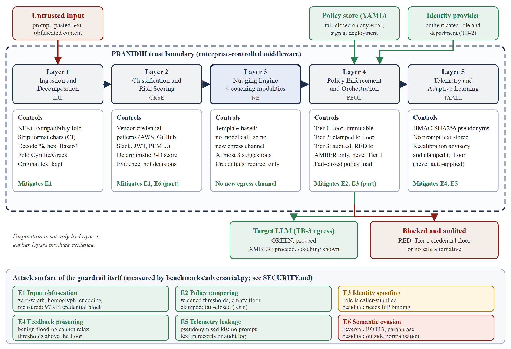

<p align="center">
  
</p>

<h1 align="center">प्रणिधि PRANIDHI</h1>
<h3 align="center">Prompt Risk Analysis, Network Inspection &amp; Data Handling Integrity</h3>

<p align="center">
  <em>Sanskrit <b>प्रणिधि</b> (praṇidhi): "the inspector; close observation; attentive watchfulness."</em><br/>
  <em>A pre-prompt coaching layer for enterprise AI: it teaches users to rewrite risky prompts instead of only blocking them.</em>
</p>

<p align="center">
  <a href="https://github.com/sunilgentyala/PRANIDHI/actions/workflows/ci.yml"></a>
  <a href="https://github.com/sunilgentyala/PRANIDHI/releases/latest"></a>
  <a href="https://opensource.org/licenses/Apache-2.0"></a>
  
  
  
</p>

<p align="center">
  <a href="https://sunilgentyala.github.io/PRANIDHI/"><b>Website</b></a> &middot;
  <a href="#architecture">Architecture</a> &middot;
  <a href="#security-posture">Security</a> &middot;
  <a href="#measured-results">Results</a> &middot;
  <a href="#quick-start">Quick start</a> &middot;
  <a href="CHANGELOG.md">Changelog</a> &middot;
  <a href="#research">Paper</a>
</p>

---

## At a glance (v0.2.0)

| | Result | Where it comes from |
|---|---|---|
| Would-be blocks turned into coached pass-throughs | **49.25 of 69.25** percentage points | `benchmarks/run_evaluation.py` (400 synthetic prompts, seed 20260721) |
| Detection quality on that corpus | precision **0.957**, recall **0.828**, F1 **0.888** | same run; recall is 1.00 for credential, PII and code prompts, 0.31 for inferential financial-leak prompts |
| Credential blocking under 8 evasion transformations | **97.9%** (was about 12% in v0.1.0) | `benchmarks/adversarial.py` |
| F1 across 25 weight and threshold configurations | **0.830 to 0.906** | `benchmarks/sensitivity.py` |
| Mean scan latency (in-process Python) | **0.075 ms** | same run as above |
| Tests | **77 passing**, ruff and mypy clean, CI on Python 3.10, 3.11, 3.12 | `tests/` |

Everything above is measured on **synthetic, templated prompts**. It is a reproducibility artefact, not a field study. See [Measured results](#measured-results) for the caveats, including a correction to the v0.1.0 numbers.

## The problem

Most AI guardrails do one thing: **block or redact**. The user gets an opaque error, learns nothing, and finds a workaround, often by moving to an unmonitored tool. PRANIDHI treats the moment a prompt is composed as a chance to **coach**: it explains what is risky and offers a safer way to ask, before anything leaves the organisation.

```
┌──────────────┐     ┌──────────────────────────────────────────┐     ┌──────────┐
│              │     │             PRANIDHI PIPELINE            │     │          │
│  User types  │────▶│   Scan → Score → Coach → Enforce → Log   │────▶│  Target  │
│  a prompt    │◀────│       suggest safer alternatives         │     │   LLM    │
│              │     │          before blocking                 │     │          │
└──────────────┘     └──────────────────────────────────────────┘     └──────────┘
```

## The Nudging Engine

When content is risky, the engine offers up to three suggestions from four strategies:

| Strategy | What it does | Illustration |
|----------|--------------|--------------|
| **Substitutive Reformulation** | Replaces flagged fragments with typed placeholders | `[REDACTED-PII]`, `[REDACTED-CREDENTIAL]` |
| **Decomposition** | Splits a multi-entity prompt into independent sub-queries | one prompt with names, revenue and strategy becomes three |
| **Abstraction Elevation** | Lifts an instance-level question to a pattern-level one | "Why did Acme Corp's Q3 revenue drop 14.7%?" becomes "What frameworks diagnose a single quarter's revenue contraction of this size?" |
| **Tool Redirection** | Sends the user to a safer execution path | credentials go to the organisation's secrets manager, never to an external model |

> **Honest scope.** In v0.2.0 these strategies are **deterministic, template-based**. No language model is called, and the confidence values are fixed design constants. A generative coaching model is on the roadmap and needs its own leakage safeguards.

## Architecture



| Layer | Role |
|---|---|
| **L1 IDL**, Ingestion and Decomposition | Normalises input (NFKC, invisible-character stripping, decoding) and extracts typed fragments |
| **L2 CRSE**, Classification and Risk Scoring | Three-dimensional score: sensitivity, contextual exposure, inferential leakage (entropy proxy) |
| **L3 NE**, Nudging Engine | Coaching suggestions, produced before enforcement |
| **L4 PEOL**, Policy Enforcement | Federated tiers: enterprise floor, business unit (can only tighten), audited role exemptions |
| **L5 TAALL**, Telemetry and Adaptive Learning | Pseudonymised metrics; recalibration proposals are advisory and clamped to the floor |

The full prompt lifecycle, including the security checkpoints, is in [`docs/architecture/pranidhi-sequence-v0.2.png`](docs/architecture/pranidhi-sequence-v0.2.png).

## Security posture

A guardrail is itself an attack surface. v0.2.0 was hardened against six threats to PRANIDHI itself and the work is covered by regression tests (`tests/test_security_posture.py`).

| ID | Threat | Control | Residual risk |
|----|--------|---------|---------------|
| E1 | Input obfuscation (zero-width, homoglyph, encoding, spacing) | NFKC fold, strip Unicode category Cf, decode percent, hex and Base64 as appended views, vendor credential patterns | Reversal, ROT13, paraphrase |
| E2 | Policy tampering or misconfiguration | Department thresholds clamped to the floor, policy cannot remove `CREDENTIAL`, fail-closed policy loading | Protect the policy file at deployment |
| E3 | Identity spoofing | None in the library | `role` and `department` are caller-supplied: bind them to your identity provider |
| E4 | Feedback-loop poisoning | Adaptive thresholds are advisory and clamped to the floor | Human review of proposals |
| E5 | Telemetry leakage | HMAC-SHA256 user pseudonyms, no prompt text in records or audit log | Key management |
| E6 | Semantic evasion | Out of scope for deterministic detection | Open |

Details, reporting instructions and the list of defects fixed in 0.2.0 are in [SECURITY.md](SECURITY.md).

## Measured results

[`benchmarks/`](benchmarks/) holds three seeded, fully synthetic evaluations of the real pipeline:

| Command | Measures |
|---|---|
| `python -m benchmarks.run_evaluation` | 400 cooperative prompts: disposition mix, detection quality and latency against a prohibition-only baseline that shares the same detection layer |
| `python -m benchmarks.adversarial` | The same secrets under ten transformations (zero-width, homoglyph, percent-encoding, Base64, fullwidth, spacing, hex, reversal, ROT13) |
| `python -m benchmarks.sensitivity` | 25 configurations of CRSE weights and thresholds |

**Main corpus (seed 20260721).** GREEN 30.75%, AMBER 49.25%, RED 20.00% (baseline RED 69.25%); precision 0.9567, recall 0.8281, F1 0.8878; coaching coverage 100%. RED stays at exactly 20% in all 25 sensitivity configurations because, with complete coaching coverage, the only remaining blocks are Tier 1 credential blocks. The headline conversion of blocks into coached pass-throughs is therefore structural, not a product of tuned thresholds.

> **Correction to v0.1.0.** v0.1.0 reported recall 0.9125 and F1 0.9359. Part of that was an artefact: the code-snippet detector matched bare English words such as "drop" and "from", so some non-code prompts were flagged by accident. v0.2.0 detects code structurally, which lowers recall to 0.8281. All 55 remaining false negatives are financial-leak prompts that contain no pattern-detectable entity, which is where the entropy proxy is weakest.

**Adversarial robustness** (credential = share blocked by the Tier 1 floor, PII = share flagged):

| Transformation | Credential v0.1.0 | Credential v0.2.0 | PII v0.1.0 | PII v0.2.0 |
|---|:---:|:---:|:---:|:---:|
| T0 plain (control) | 0.17 | 1.00 | 1.00 | 1.00 |
| T1 zero-width injection | 0.21 | 1.00 | 1.00 | 1.00 |
| T2 Cyrillic homoglyphs | 0.19 | 1.00 | 1.00 | 1.00 |
| T3 percent-encoding | 0.19 | 1.00 | 1.00 | 1.00 |
| T4 Base64 wrapping | 0.20 | 1.00 | 0.67 | 1.00 |
| T5 fullwidth forms | 0.00 | 1.00 | 0.00 | 1.00 |
| T6 character spacing | 0.00 | 0.83 | 1.00 | 1.00 |
| T7 hexadecimal | 0.00 | 1.00 | 0.08 | 1.00 |
| T8 reversed string | 0.05 | 0.05 | 0.33 | 0.33 |
| T9 ROT13 | 0.04 | 0.04 | 0.67 | 0.67 |

T8 and T9 are outside the normalisation layer by design. The transformations were written by the same authors as the defences, so this measures coverage of known tricks, not resistance to an adaptive adversary.

## Quick start

```bash
git clone https://github.com/sunilgentyala/PRANIDHI.git
cd PRANIDHI
pip install -e ".[dev]"
pytest tests/ -q
```

```python
from pranidhi import PranidhiPipeline

pipeline = PranidhiPipeline(policy_path="policies/default.yaml")

result = pipeline.scan(
    "Analyse John Smith's account #4521-8876 for fraud patterns",
    {"role": "analyst", "department": "risk", "target_platform": "claude"},
)
print(result.disposition.value, round(result.risk_score, 3))
for s in result.suggestions:
    print(s.strategy.value, "|", s.confidence)
```

Output from v0.2.0 (real, not illustrative):

```
AMBER 0.552
ABSTRACTION_ELEVATION | 0.7
```

A prompt carrying a credential is blocked at the enterprise floor and redirected rather than reformulated:

```
RED 0.723
TOOL_REDIRECTION | 0.95        # "Use your organisation's secrets manager or internal vault."
```

Note that the person's name in the first prompt is **not** detected: the pattern-based detectors cover credentials, account numbers, SSNs, emails, phone numbers, IPs and URLs, not names. That gap is part of the documented limitations.

### Policy file

```yaml
enterprise_floor:
  absolute_block_entities: [CREDENTIAL]   # can add entities, never remove CREDENTIAL
departments:
  legal:
    block_threshold: 0.5      # tighter than the 0.70 floor: honoured
  marketing:
    block_threshold: 0.95     # looser than the floor: clamped to 0.70 and logged
exempt_roles: [red_team]      # downgrades RED to AMBER, audited, never overrides Tier 1
```

A missing or malformed policy file fails closed: no role exemptions, no department overrides.

### Docker

```bash
docker build -t pranidhi:latest -f deploy/docker/Dockerfile .
```

## Repository structure

```
PRANIDHI/
├── src/pranidhi/
│   ├── idl/             # Layer 1: normalisation and decomposition
│   ├── crse/            # Layer 2: risk scoring
│   ├── nudging_engine/  # Layer 3: four coaching strategies
│   ├── peol/            # Layer 4: federated policy enforcement
│   ├── taall/           # Layer 5: pseudonymised telemetry
│   ├── connectors/      # platform adapter stubs
│   └── pipeline.py      # PranidhiPipeline facade
├── tests/               # 77 tests, including test_security_posture.py
├── benchmarks/          # corpus, baseline, adversarial and sensitivity evaluations (+ committed JSON results)
├── policies/            # default and example policies
├── deploy/docker/       # Dockerfile
└── docs/                # GitHub Pages site and architecture figures
```

## How it compares

Capabilities below are taken from each product's **public documentation** as reviewed for the paper; "Not documented" means the capability was not found, not that it is proven absent. PRANIDHI's cells describe this reference implementation, not a production service.

| Capability | Zscaler AI Guard | Nightfall AI | Lasso Security | NeMo Guardrails | **PRANIDHI** |
|-----------|:---:|:---:|:---:|:---:|:---:|
| Sensitive-data detection | ✅ | ✅ | ✅ | ✅ | ✅ |
| Prompt blocking | ✅ | ✅ | ✅ | ✅ | ✅ |
| Advisory coaching instead of block or allow | Not documented | Not documented | Not documented | Not documented | ✅ template-based |
| Inferential-leakage scoring | Not documented | Not documented | Not documented | Not documented | ⚠️ coarse entropy proxy |
| Federated, tightening-only policy tiers | Not documented | Not documented | Not documented | Not documented | ✅ |
| Telemetry-driven recalibration | Not documented | Not documented | Not documented | Not documented | ⚠️ advisory only |
| Open source and auditable detection | ❌ | ❌ | ❌ | ✅ | ✅ |
| Independent benchmark outside vendor material | Not documented | Not documented | Not documented | ✅ for jailbreak filtering | ⚠️ synthetic only |

## The name: प्रणिधि (PRANIDHI)

**Praṇidhi** is a Sanskrit term meaning "the inspector," "close observation," or "attentive watchfulness directed toward a specific object." It denotes disciplined, purposeful scrutiny that yields understanding, not passive surveillance. PRANIDHI observes every enterprise prompt with discernment, identifies latent risk, and guides the user toward a safer formulation before a single token reaches an external AI system.

## Roadmap

- [x] Five-layer reference pipeline, 77 tests, CI green (v0.2.0)
- [x] Security hardening and trust-boundary model (v0.2.0)
- [x] Reproducible cooperative, adversarial and sensitivity benchmarks
- [ ] Bind `role` and `department` to an authenticated identity provider
- [ ] Semantic detector for paraphrase-level leakage and name entities
- [ ] Generative coaching model with leakage safeguards
- [ ] Annotated, human-reviewed benchmark corpus (10,000+ prompts)
- [ ] Connectors for Claude, OpenAI, Perplexity, Grok and Gemini APIs
- [ ] Browser and VS Code extensions

## Research

A paper describing PRANIDHI, "Enterprise Large Language Model Governance: A Systematic Survey and Coaching-Augmented Pre-Prompt Risk Mitigation Framework," is under review at *Information and Software Technology* (Elsevier). It is not yet accepted or published. This repository is the reproducible source of truth for the framework's behaviour.

## Contributing

Contributions are welcome; see [CONTRIBUTING.md](CONTRIBUTING.md). Useful areas: coaching quality, a real annotated corpus, platform connectors, multilingual detection, and independent evaluation.

## Citation

```bibtex
@unpublished{gentyala2026pranidhi,
  title  = {Enterprise Large Language Model Governance: A Systematic Survey
            and Coaching-Augmented Pre-Prompt Risk Mitigation Framework},
  author = {Gentyala, Sunil and Shariff, Vahiduddin and Gottemukkala, Lavanya
            and Sujitha, M. Jeevana and Rajkumar, K. Varada
            and Rao, Bagadi Gowrisankara},
  note   = {Manuscript submitted for publication to Information and Software
            Technology (Elsevier)},
  year   = {2026}
}
```

## License

Apache License 2.0. See [LICENSE](LICENSE).

---

<p align="center">
  <strong>प्रणिधि PRANIDHI</strong>: the attentive inspector that teaches, not merely blocks.
</p>
