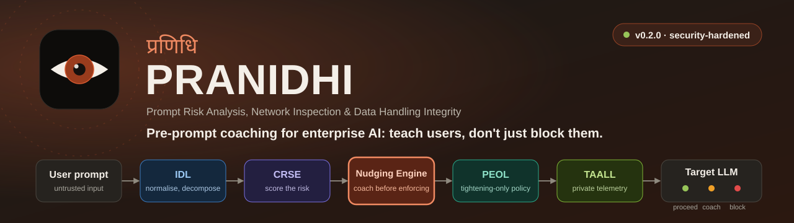

<p align="center">
  
</p>

<h1 align="center">प्रणिधि PRANIDHI</h1>
<h3 align="center">Prompt Risk Analysis, Network Inspection & Data Handling Integrity</h3>

<p align="center">
  <em>Sanskrit: <b>प्रणिधि</b> (praṇidhi) — "the inspector; close observation; attentive watchfulness."</em><br/>
  <em>PRANIDHI observes enterprise prompts with unwavering attentiveness before they reach AI.</em>
</p>

<p align="center">
  <a href="https://opensource.org/licenses/Apache-2.0"></a>
  <a href="#"></a>
  <a href="#"></a>
  <a href="#"></a>
</p>

<p align="center">
  <a href="https://sunilgentyala.github.io/PRANIDHI/"><strong>View Interactive Architecture Diagram</strong></a>
</p>

---

## The Problem

Every existing AI guardrail tool does the same thing: **block or redact**. They scan your prompt, find sensitive data, and either kill the request or silently strip the offending content. The user gets an opaque error. They learn nothing. They find a workaround.

> **13% of enterprise AI prompts contain sensitive data** (Lasso Security, 2025).  
> **38% of employees input sensitive data into unauthorised AI tools** (IBM, 2025).  
> **Shadow AI adds $670K to average breach costs** (IBM Cost of a Data Breach, 2025).

The block-and-redact paradigm is failing because it treats users as threats instead of collaborators.

## What PRANIDHI Does Differently

PRANIDHI is the first **pre-prompt coaching framework** for enterprise AI interactions. Instead of just blocking dangerous prompts, it **teaches users how to rewrite them safely** — in real time, before submission.

```
┌──────────────┐     ┌──────────────────────────────────────────┐     ┌──────────┐
│              │     │           PRANIDHI PIPELINE              │     │          │
│  User types  │────▶│  Scan → Score → Coach → Enforce → Log   │────▶│  Claude  │
│  a prompt    │◀────│         ▲ Suggest safer alternatives     │     │  ChatGPT │
│              │     │         │ before blocking                │     │  Grok    │
└──────────────┘     └──────────────────────────────────────────┘     └──────────┘
```

### Core Innovation: The Nudging Engine

When PRANIDHI detects sensitive content, it doesn't just say "blocked." It offers **four coaching strategies**:

| Strategy | What It Does | Example |
|----------|-------------|---------|
| **Substitutive Reformulation** | Replaces real data with synthetic equivalents | "Analyse *Client-A's* $2.3M contract" → "Analyse a mid-size client contract in the $2-3M range" |
| **Decomposition** | Splits a risky multi-entity prompt into safe sub-queries | One prompt with names + revenue + strategy → three separate safe prompts |
| **Abstraction Elevation** | Lifts specific instances to general patterns | "Why did Acme Corp's Q3 revenue drop 14.7%?" → "What frameworks analyse 10-20% revenue declines from single-client loss?" |
| **Tool Redirection** | Routes to a safer execution path | "Use the internal sandbox model instead" or "Query the approved knowledge base" |

## Architecture

PRANIDHI operates as a **five-layer middleware pipeline**:

```
Layer 1: IDL   — Ingestion & Decomposition Layer
                 Tokenises input, detects encoding tricks, extracts metadata

Layer 2: CRSE  — Classification & Risk Scoring Engine
                 Three-dimensional scoring: sensitivity × exposure × inferential leakage

Layer 3: NE    — Nudging Engine (core innovation)
                 Real-time coaching with four intervention strategies

Layer 4: PEOL  — Policy Enforcement & Orchestration Layer
                 Federated policies: enterprise floor + business unit + role-based

Layer 5: TAALL — Telemetry, Analytics & Adaptive Learning Layer
                 Behavioural analytics, adaptive thresholds, coaching effectiveness tracking
```

## Quick Start

### Installation

```bash
pip install pranidhi
```

### Basic Usage

```python
from pranidhi import PranidhiPipeline

pipeline = PranidhiPipeline(policy_path="policies/default.yaml")

result = pipeline.scan(
    prompt="Analyse John Smith's account #4521-8876 for fraud patterns",
    user_context={
        "role": "analyst",
        "department": "risk",
        "target_platform": "claude"
    }
)

print(result.risk_score)        # 0.82 (High)
print(result.disposition)       # "COACH" (not "BLOCK")
print(result.suggestions)       # List of safer reformulations
# → "Analyse a sample customer account for common fraud indicators"
# → "What fraud detection patterns apply to accounts showing unusual activity?"
```

### Docker Deployment

```bash
docker build -t pranidhi:latest -f deploy/docker/Dockerfile .
docker run -p 8080:8080 -v ./policies:/app/policies pranidhi:latest
```

## Repository Structure

```
pranidhi/
├── src/
│   └── pranidhi/
│       ├── idl/                    # Layer 1: Ingestion & Decomposition
│       ├── crse/                   # Layer 2: Classification & Risk Scoring
│       ├── nudging_engine/         # Layer 3: The Nudging Engine
│       │   ├── strategies/         # Four coaching strategy implementations
│       │   └── templates/          # Coaching response templates
│       ├── peol/                   # Layer 4: Policy Enforcement
│       ├── taall/                  # Layer 5: Telemetry & Adaptive Learning
│       ├── connectors/             # Platform adapters (Claude, OpenAI, etc.)
│       └── shared/                 # Common utilities
├── tests/                          # 36 passing tests across all five layers
├── benchmarks/                     # PPHB benchmark corpus
├── policies/                       # Policy templates and examples
├── deploy/                         # Docker, Kubernetes configurations
└── docs/                           # Architecture docs, API reference, papers
```

## How It Compares

| Capability | Zscaler AI Guard | Nightfall AI | Lasso Security | NeMo Guardrails | **PRANIDHI** |
|-----------|:---:|:---:|:---:|:---:|:---:|
| PII/PHI Detection | ✅ | ✅ | ✅ | ✅ | ✅ |
| Prompt Blocking | ✅ | ✅ | ✅ | ✅ | ✅ |
| Data Masking/Redaction | ✅ | ✅ | ✅ | ❌ | ✅ |
| **Real-Time Prompt Coaching** | ❌ | ❌ | ❌ | ❌ | **✅** |
| **Reformulation Suggestions** | ❌ | ❌ | ❌ | ❌ | **✅** |
| **Inferential Leakage Scoring** | ❌ | ❌ | ❌ | ❌ | **✅** |
| Cross-Platform Normalisation | Partial | ❌ | Partial | ❌ | **✅** |
| **Behavioural Learning Loop** | ❌ | ❌ | ❌ | ❌ | **✅** |
| Federated Policy Hierarchies | ❌ | ❌ | ❌ | ❌ | **✅** |
| Open Source | ❌ | ❌ | ❌ | ✅ | **✅** |

## The Name: प्रणिधि (PRANIDHI)

**Praṇidhi** (प्रणिधि) is a Sanskrit term meaning "the inspector," "close observation," or "attentive watchfulness directed toward a specific object." In classical Indian philosophy, praṇidhi denotes the disciplined act of directing one's awareness with precision and intentionality — not passive surveillance, but active, purposeful scrutiny that yields understanding.

PRANIDHI embodies this philosophy: it is the attentive inspector that observes every enterprise prompt with discernment, understanding the user's intent, identifying latent risks, and guiding the user toward safer formulations — all before a single token reaches an external AI system.

**Full Acronym:** **P**rompt **R**isk **A**nalysis, **N**etwork **I**nspection & **D**ata **H**andling **I**ntegrity

## Research

A paper describing PRANIDHI, "Enterprise Large Language Model Governance: A Systematic Survey and Coaching-Augmented Pre-Prompt Risk Mitigation Framework," is currently under review at *Information and Software Technology* (Elsevier). It is not yet accepted or published; this repository remains the primary, reproducible source of truth for the framework's design and behaviour.

### Reproducible evaluation

[`benchmarks/`](benchmarks/) contains a small, fully-synthetic, seeded prompt corpus (`corpus.py`) and an evaluation harness (`run_evaluation.py`) that runs the real pipeline in `src/pranidhi` against it and against a prohibition-only baseline that shares the same detection layer. Run it yourself:

```bash
python -m benchmarks.run_evaluation
```

This is a reproducibility artifact, not a live enterprise deployment or a human-subjects study — every number it produces comes from executing the actual code in this repository against synthetic, templated prompts.

## Roadmap

- [x] Core architecture specification
- [x] Gap analysis and competitive positioning
- [x] Five-layer pipeline with 36 passing tests
- [x] Reproducible synthetic-corpus evaluation harness (`benchmarks/`)
- [ ] Nudging Engine — advanced LLM-powered reformulation
- [ ] Browser extension (Chrome/Firefox)
- [ ] VS Code extension
- [ ] Large-scale annotated benchmark corpus (10,000+ prompts, human-reviewed)
- [ ] Connector: Claude API
- [ ] Connector: OpenAI API
- [ ] Connector: Perplexity, Grok, Gemini APIs

## Contributing

We welcome contributions! See [CONTRIBUTING.md](CONTRIBUTING.md) for guidelines.

Key areas where help is needed:
1. **Nudging Engine strategies** — Improving reformulation quality
2. **Benchmark corpus** — Contributing annotated enterprise prompts
3. **Platform connectors** — Adding support for new AI platforms
4. **Multilingual support** — Extending detection and coaching beyond English
5. **Evaluation** — Running user studies and reporting results

## Citation

```bibtex
@unpublished{gentyala2026pranidhi,
  title={Enterprise Large Language Model Governance: A Systematic Survey
         and Coaching-Augmented Pre-Prompt Risk Mitigation Framework},
  author={Gentyala, Sunil and Shariff, Vahiduddin and Gottemukkala, Lavanya
          and Sujitha, M. Jeevana and Rajkumar, K. Varada
          and Rao, Bagadi Gowrisankara},
  note={Manuscript submitted for publication to Information and Software
        Technology (Elsevier)},
  year={2026}
}
```

## License

Apache License 2.0. See [LICENSE](LICENSE) for details.

---

<p align="center">
  <strong>प्रणिधि PRANIDHI</strong> — The attentive inspector that teaches, not merely blocks.
</p>
